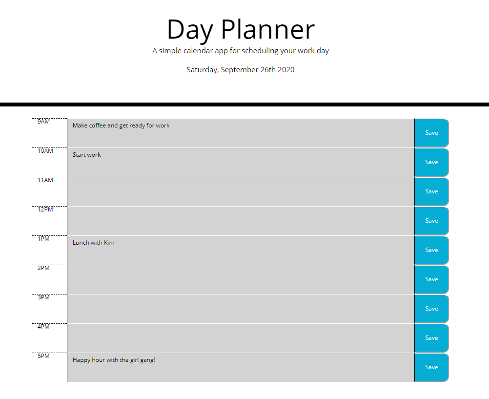
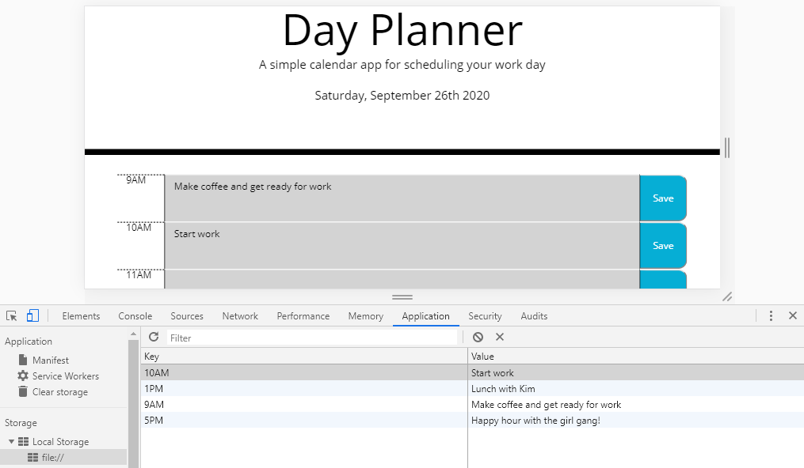

# Day Scheduler

This day planner is a simple calendar application that allows the user to save events for each hour of the day to manage their time effectively. The app runs in the browser and feature dynamically updated HTML and CSS powered by jQuery. 

The app reflects past time as gray, present as red, and future as green. 

In the image below, the current time was 7:00PM; therefore, all the text fields are gray, signifiying that the corresponding hours have passed. 

 

 

The next image below shows that the text field is saved into the browser's Local Storage once the "Save" button is clicked. 

 

 

## Coding Process

There were many components tied to creating this day planner application. Using third-party APIs such as moment.js and Bootstrap grid along with jQuery and CSS styling, I was able to create the application to look and function as a day scheduler. 

To view the live website, please navigate to the **Deployed Link** below or  [click here](https://christyglee.github.io/work-day-scheduler/) to view the page.

 

## Powered By

* [HTML](https://developer.mozilla.org/en-US/docs/Web/HTML)
* [CSS](https://developer.mozilla.org/en-US/docs/Web/CSS)
* [Javascript](https://developer.mozilla.org/en-US/docs/Web/JavaScript)
* [Bootstrap](https://getbootstrap.com/)
* [Moment.js](https://momentjs.com/)

 

### Other Resources Used

* [Visual Studio Code](https://code.visualstudio.com/)
    * [How to install VS Code](https://code.visualstudio.com/docs/setup/setup-overview)
* [GitBash](https://gitforwindows.org/)
    * [Download GitBash for Windows](https://git-scm.com/downloads)

 

## Deployed Link

* [See Live Site](https://christyglee.github.io/work-day-scheduler/)

 

## Author
**Christy Lee** 

- [Github](https://github.com/christyglee)
- [LinkedIn](https://www.linkedin.com/in/christy-lee-95943748/)

  

## Acknowledgments

* [Google-Fu](https://www.google.com)
* [w3schools](https://www.w3schools.com/)
* [Stack Overflow](https://stackoverflow.com/search?q=over)
* [Bootstrap](https://getbootstrap.com/)
* [Moment.js](https://momentjs.com/)